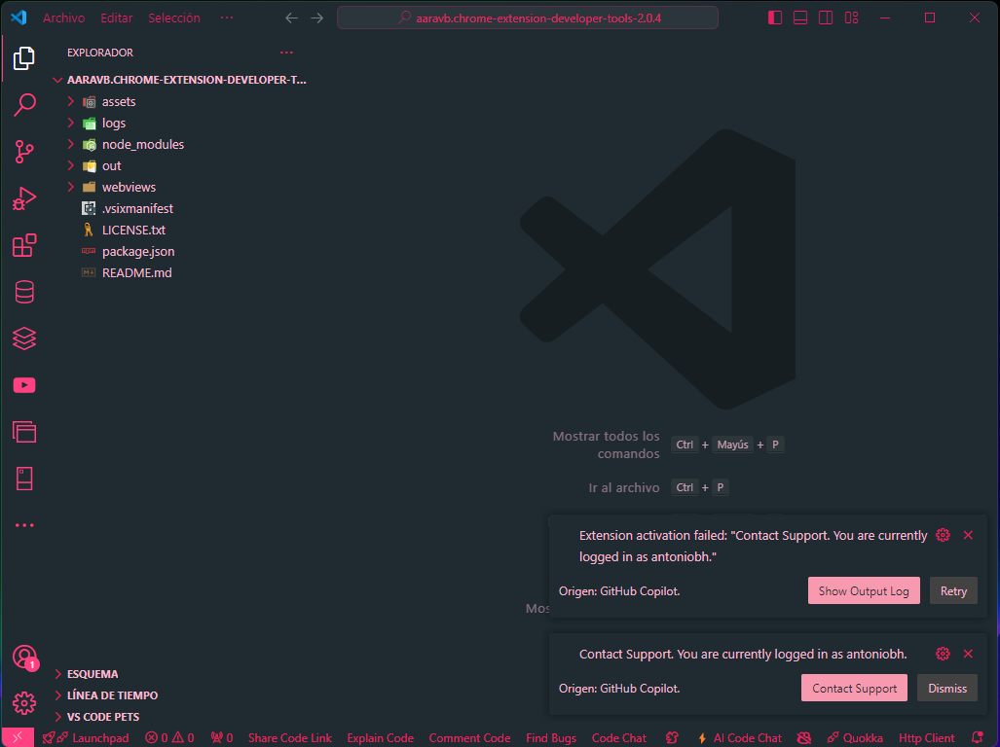

# Blackpink Theme for VS Code

### Autor

Antonio Benavides H.
[GitHub](https://github.com/antoniobh)

## Descripción

**Blackpink Theme** es un tema oscuro inspirado en el grupo de K-Pop Blackpink. Con una paleta de colores que combina tonos rosados y grises oscuros, este tema está diseñado para ofrecer una experiencia visual elegante y moderna mientras trabajas en tu código.

## Capturas de Pantalla

## Instalación

1. Abre Visual Studio Code.
2. Ve a la sección de Extensiones en la barra lateral.
3. Busca `Blackpink Theme`.
4. Haz clic en `Instalar`.
5. Ve a `Preferencias` > `Tema de Color` y selecciona `Blackpink Theme` para activar el tema.
